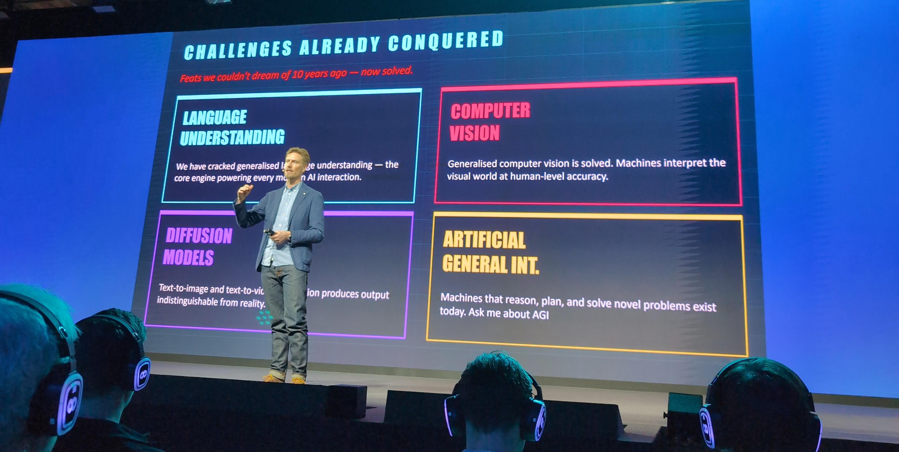
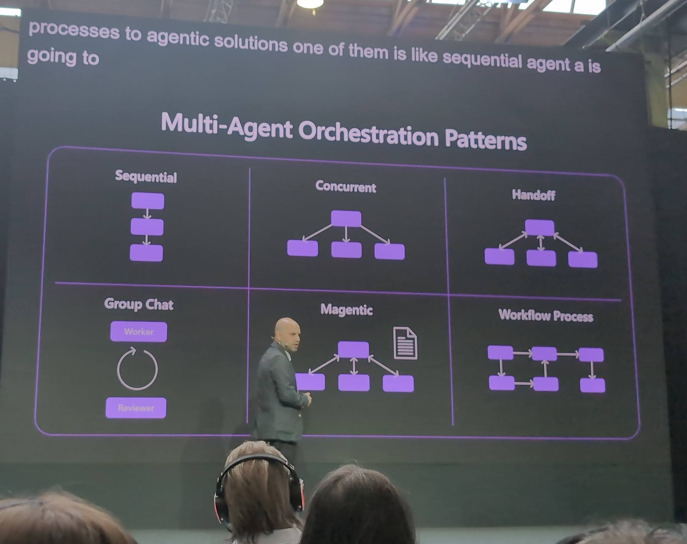
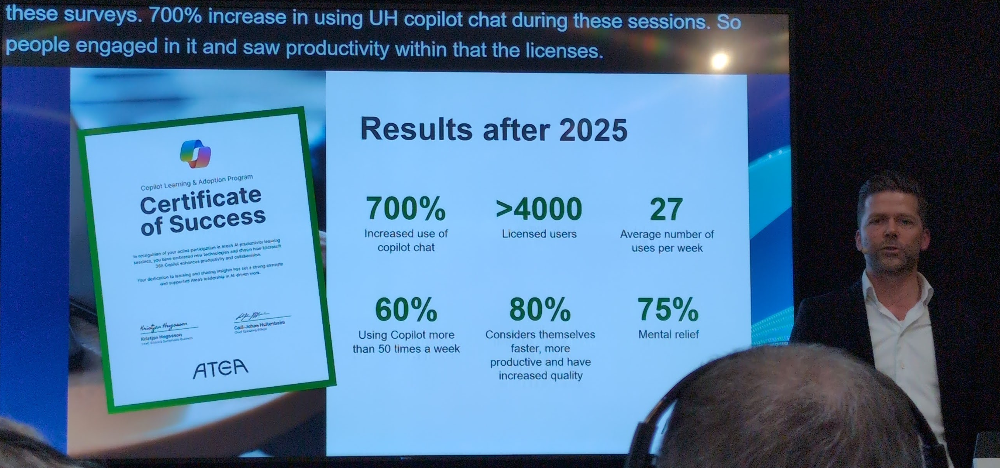
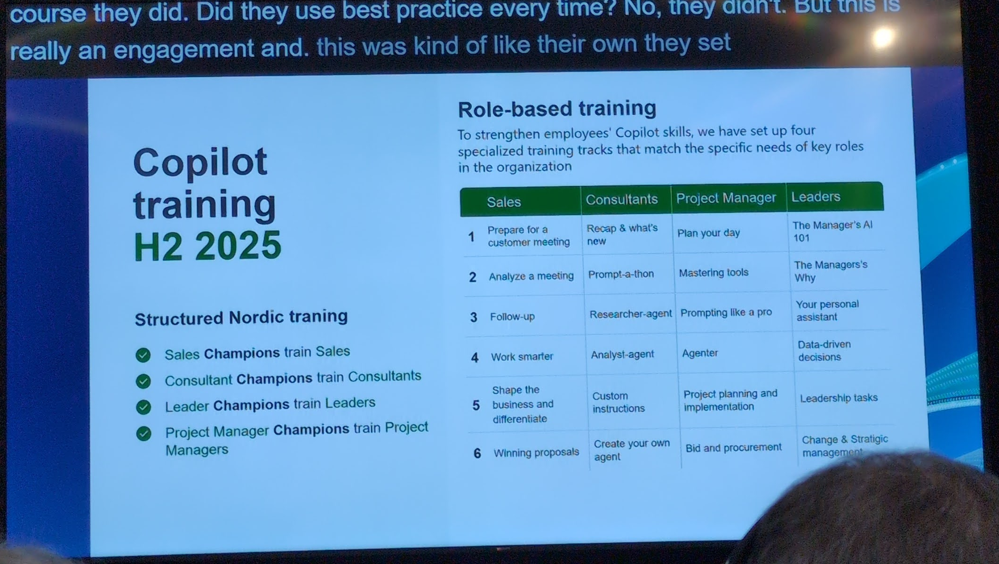
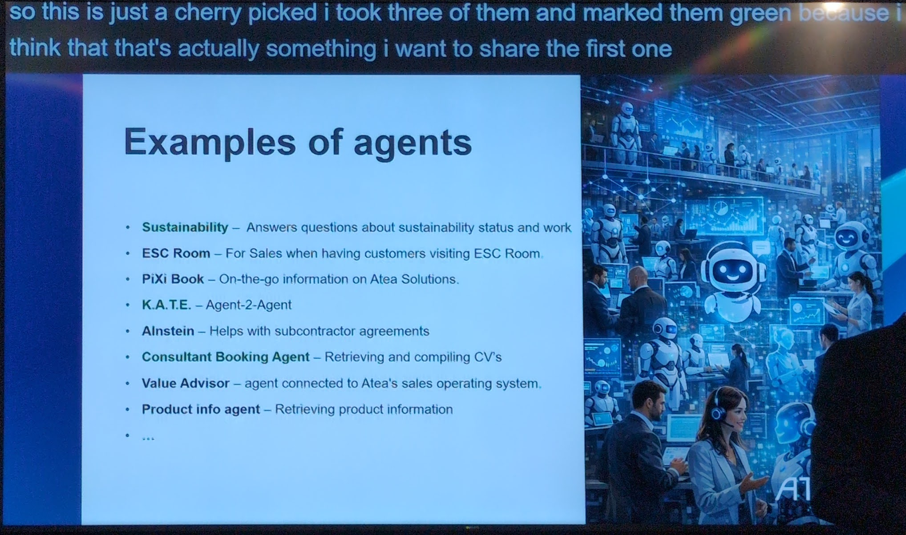
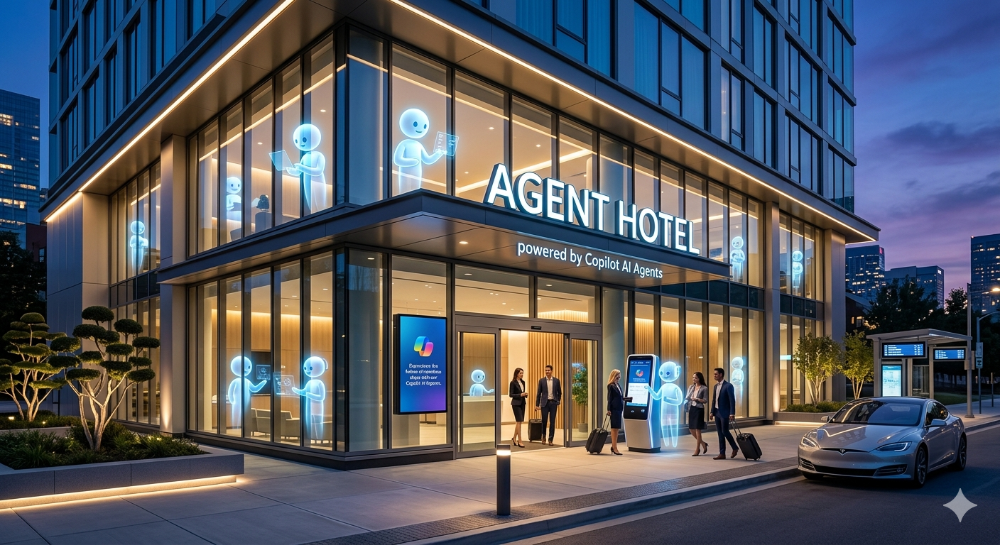
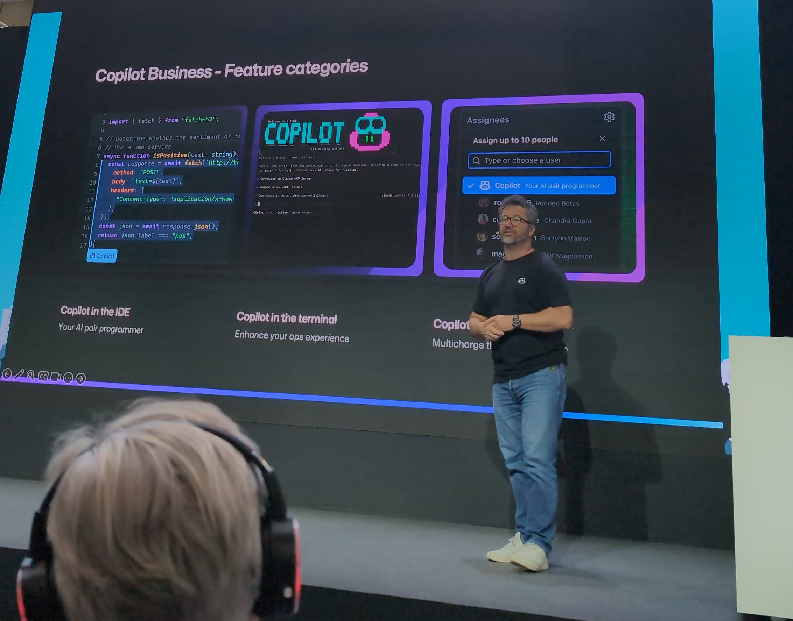

# Microsoft ai tour

The event was here in Copenhagen, at the Lokomotivværkstedet (close to Dybbølsbro).


## Itinery

- Keynote
- Driving business innovation with Al apps and agents
- **Building enterprise-ready Al agents with Microsoft Foundry**
- **Customer zero: employ model for scaling AI**
- **GitHub Copilot as an Al agent in the developer workflow**


## Keynote


Keynote was a lot about new AI  features (surrounding agents and copilot).
Focus was on presenting Copilot cowork and Copilot studio
- start when email received or other triggers
- can connect to other agents, for more functionality 
- can test trigger
Passing tasks outputs from one agent to another/department to department - utilizing copilot studio.


## Driving business innovation with Al apps and agents

Presentation by Novo Nordisk. 
A close collaboration with Microsoft where they had people coming and working together at Novo office.
Building a custom agent.


An interesting presenter was from microsoft, who's been working in the AI field.
We only use 20% of ai models capabilities across all providers
Feats we couldn't dream 10 years ago are not solved.



## Building enterprise-ready Al agents with Microsoft Foundry

`Microsoft Foundry Local` is "Infrastructure," while the `Agent Framework` is "Orchestration."
Examples of how to use `Microsoft agent framework` to build custom agents. 
Not new (Shown before, an agent for querying multiple sources to figure out how microsoft is complying with e.g. EU GDPR regulations.).

```
using System;
using Azure.AI.Projects;
using Azure.Identity;
using Microsoft.Agents.AI;

AIAgent agent = new AIProjectClient(
        new Uri("https://your-foundry-service.services.ai.azure.com/api/projects/your-foundry-project"),
        new AzureCliCredential())
    .AsAIAgent(
        model: "gpt-5.4-mini",
        instructions: "You are a friendly assistant. Keep your answers brief.");

Console.WriteLine(await agent.RunAsync("What is the largest city in France?"));
```

Can run locally to test using `Foundry Local`.


## Building enterprise-ready Al agents with Microsoft Foundry -2

DevUI: Workflow Visualization: 


Multi-Agent Orchestation patterns



## Customer zero: employ model for scaling AI

ATEA presenting. 
Hardcore AI focus. Has already more agents than employees.

**The shift from using copilot - from questions to tasks.**

2025 results:


Specialized training tracks:



## Customer zero: employ model for scaling AI - 2

Examples of some of the most popular agents they have/are using:



## Customer zero: employ model for scaling AI - 3 
Ambition/goal:


## Customer zero: employ model for scaling AI - 4

And...



## GitHub Copilot as an Al agent in the developer workflow

Final talk! Demo by SimCorp.
Path of agentic development.


What each model was used for:


## GitHub Copilot as an Al agent in the developer workflow - 2 

GitHub copilot agents:
- agent mode
- delegate to agent to implement
- assign to review


- copilot in IDE
- copilot in terminal
- copilot in web



## GitHub Copilot as an Al agent in the developer workflow - 3

Speaker final notes:
- You won't be able to review all the code as a human
- Use copilot reviewer first
- Who's the best with ai? Might be not the best engineer but the most curious ones
- The era of ai as text is over (the shift from Generative AI (chatting) to Agentic AI (doing))
- Use CLI to think not as conversation but delegation - more efficient. 


## GitHub Copilot as an Al agent in the developer workflow - helpfull commands

Running tasks in parallel with the `/fleet` command.
The /fleet slash command lets Copilot CLI break down a complex request into smaller tasks and run them in parallel, maximizing efficiency and throughput.
https://docs.github.com/en/copilot/concepts/agents/copilot-cli/fleet


`/chronicle` (session storage) and ask to improve weekly:
analyzes your local session history to provide insights into your workflow, progress, and how you can better interact with the AI. It essentially turns your past CLI interactions into a queryable "memory" to help you reflect and improve.

`/chronicle standup` - ⚡ For Daily Reporting, eliminates the "What did I do yesterday?"
- example:
```
Standup for 2026-04-21:

🚧 In Progress

MP-Config (master branch)

 - Chronicle standup session started
 - Session: e9b31eb3-fce0-4a9a-8aca-d7dd128e71c3

MP-Config – Fixing If Conditions (MKUC/fixing-if-conditions branch)

 - Chronicle standup completed
 - Session: 2b4cb4ef-9f3c-4211-9587-aee22eb821f5
```

`/chronicle improve` - 🛠️ For Optimization, identifies patterns of failure and automates the creation of "Custom Instructions,"
`/chronicle tips` - 💡 For Skill Building, acts as a personal productivity coach


## GitHub Copilot as an Al agent in the developer workflow - SimCorp

SimCorp presenter request usage, What happens when you use Opus for everything:
